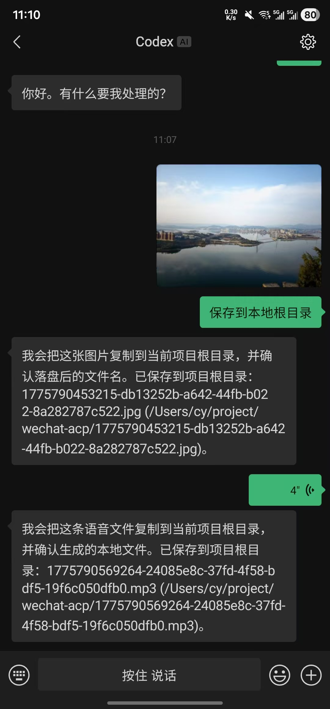

# WeChat Media Agent

[English](./README.md) | [简体中文](./README.zh-CN.md)

将微信私聊消息与媒体内容桥接到任意兼容 ACP 的 AI Agent。

`wechat-media-agent` 通过微信 iLink Bot API 登录，轮询接收一对一消息，将消息通过 stdio 转发给 ACP Agent，并把 Agent 的回复再发送回微信。

## 说明

本仓库基于原始 `wechat-acp` 项目继续开发，并按 MIT License 分发。

这个分支保留了原始许可证与署名，同时增加了本地媒体落盘能力，使 Agent 可以处理来自微信的图片、视频和语音文件。

Fork 仓库地址：[EPSON-LEE/wechat-media-agent](https://github.com/EPSON-LEE/wechat-media-agent)



## 功能特性

- 支持微信二维码登录，并在终端渲染二维码
- 每个微信用户独立对应一个 ACP Session 和 Agent 子进程
- 内置常见 CLI Agent 的 ACP 预设
- 支持自定义原始 Agent 启动命令
- 自动批准 Agent 的权限请求
- 自动将收到的图片、视频、语音保存到本地
- 将已保存的本地媒体路径一并传给 Agent，方便后续处理
- 当前仅处理私聊消息，群聊消息会被忽略
- 支持后台守护进程模式

## 环境要求

- Node.js 20+
- 可使用微信 iLink Bot API 的微信环境
- 本地可用或可通过 `npx` 启动的 ACP 兼容 Agent

## 快速开始

使用内置 Agent 预设启动：

```bash
npx wechat-media-agent --agent copilot
```

或使用自定义原始命令：

```bash
npx wechat-media-agent --agent "npx my-agent --acp"
```

首次运行时，程序会：

1. 启动微信二维码登录
2. 在终端输出二维码
3. 将登录 token 保存到 `~/.wechat-media-agent`
4. 开始轮询私聊消息

## 内置 Agent 预设

查看当前内置预设：

```bash
npx wechat-media-agent agents
```

当前预设包括：

- `copilot`
- `claude`
- `gemini`
- `qwen`
- `codex`
- `opencode`

这些预设会在内部解析成具体的 `command + args`，因此不需要手动输入很长的 `npx ...` 命令。

## CLI 用法

```text
wechat-media-agent --agent <preset|command> [options]
wechat-media-agent agents
wechat-media-agent stop
wechat-media-agent status
```

参数说明：

- `--agent <value>`：内置预设名或自定义 Agent 命令
- `--cwd <dir>`：Agent 进程工作目录
- `--login`：强制重新扫码登录并覆盖旧 token
- `--daemon`：登录完成后转为后台运行
- `--config <file>`：加载 JSON 配置文件
- `--idle-timeout <minutes>`：Session 空闲超时，默认 `1440` 分钟，传 `0` 表示不自动清理
- `--max-sessions <count>`：最大并发用户 Session 数，默认 `10`
- `--show-thoughts`：将 Agent 的思考过程转发到微信，默认关闭
- `-h, --help`：显示帮助

示例：

```bash
npx wechat-media-agent --agent copilot
npx wechat-media-agent --agent claude --cwd D:\code\project
npx wechat-media-agent --agent "npx @github/copilot --acp"
npx wechat-media-agent --agent gemini --daemon
```

## 配置文件

可以通过 `--config` 指定 JSON 配置文件。

示例：

```json
{
  "agent": {
    "preset": "copilot",
    "cwd": "D:/code/project"
  },
  "session": {
    "idleTimeoutMs": 86400000,
    "maxConcurrentUsers": 10
  }
}
```

也可以覆盖或新增 Agent 预设：

```json
{
  "agent": {
    "preset": "my-agent"
  },
  "agents": {
    "my-agent": {
      "label": "My Agent",
      "description": "Internal team agent",
      "command": "npx",
      "args": ["my-agent-cli", "--acp"]
    }
  }
}
```

## 运行行为

- 每个微信用户都会拥有独立的 ACP Session 和 Agent 子进程
- 同一用户的消息会串行处理，避免上下文冲突
- 收到的图片、视频、语音会先下载、解密并保存到本地，再转发给 Agent
- Prompt 中会包含本地媒体路径，便于 Agent 直接访问磁盘上的真实文件
- 回复发送回微信前会经过格式整理
- 如果微信 API 支持，会发送输入中状态
- Session 长时间空闲后会被清理，传 `idleTimeoutMs = 0` 可禁用

## 存储目录

默认运行时文件会保存在：

```text
~/.wechat-media-agent
```

目录内容包括：

- 已保存的登录 token
- 守护进程 pid 文件
- 守护进程日志文件
- 消息同步状态
- 保存在 `media/YYYY-MM-DD/` 下的图片、视频、语音文件

## 可选 Docker 部署

如果希望长期运行 bridge/admin，可以使用 Docker Compose：

```bash
docker compose up --build
```

默认后台页面地址是 `http://127.0.0.1:8787`。Agent 选择、数据卷、端口和容器内限制见 [Docker 部署说明](./docs/docker.md)。

## 当前限制

- 当前仅支持私聊消息，群聊消息会被忽略
- 暂未使用 MCP Server
- 权限请求会自动批准
- Agent 通信方式目前仅支持通过 stdio 启动子进程
- 某些内置 Agent 预设可能需要先单独完成登录认证

## 本地开发

开发时可执行：

```bash
npm install
npm run build
```

本地运行已构建 CLI：

```bash
node dist/bin/wechat-media-agent.js --help
```

监听模式：

```bash
npm run dev
```

## 许可证

MIT

在你重新分发或修改本项目时，请保留原始版权声明与 MIT 许可证文本。
